# 😺 ChromaCat ✨

> _Because your terminal deserves to be fabulous_ ✨

[](LICENSE)
[](https://crates.io/crates/chromacat)
[]()

ChromaCat is a turbocharged terminal colorizer written in Rust that brings stunning gradient patterns and animations to your command-line experience. Think `lolcat` but with superpowers! 🚀

## ✨ Features

- 🎨 **Rich Pattern Library**: Nine distinct pattern types from simple gradients to psychedelic plasma effects
- 🌈 **40+ Built-in Themes**: Everything from classic rainbow to custom color schemes
- 🔄 **Smooth Animations**: Breathe life into your terminal with fluid color transitions
- 🎮 **Interactive Mode**: Real-time control over animations and effects
- 🎯 **Precise Control**: Fine-tune every aspect of your gradients
- 🦀 **Blazing Fast**: Optimized Rust implementation with minimal overhead
- 🌍 **Full Unicode Support**: Works beautifully with emojis and international text
- 📱 **Terminal-Aware**: Adapts to terminal dimensions and capabilities

## 🚀 Installation

### Using Cargo (Recommended)

```bash
cargo install chromacat
```

### From Source

```bash
git clone https://github.com/hyperb1iss/chromacat
cd chromacat
cargo build --release
```

### Homebrew

```bash
brew install hyperb1iss/tap/chromacat
```

## 🎯 Quick Start

```bash
# Basic usage
echo "Hello, ChromaCat!" | chromacat

# Choose a theme
ls -la | chromacat -t cyberpunk

# Add some animation
cat your_file.txt | chromacat -a

# Use a specific pattern
echo "Wave pattern!" | chromacat -p wave --param amplitude=1.5
```

## 🎨 Pattern Types

ChromaCat offers several pattern types for dynamic colorization:

- `horizontal` - Classic left-to-right gradient (default)
- `diagonal` - Angled gradient with customizable direction
- `plasma` - Psychedelic plasma effect using sine waves
- `ripple` - Concentric circles emanating from center
- `wave` - Flowing wave distortion pattern
- `spiral` - Hypnotic spiral pattern from center
- `checkerboard` - Alternating gradient colors in a grid
- `diamond` - Diamond-shaped gradient pattern
- `perlin` - Organic, cloud-like noise pattern
- `pixel_rain` - Matrix-style digital rain effect

## 🎨 Theme Gallery

ChromaCat comes with over 40 built-in themes across multiple categories. Here's a sample of what's available:

### 🌌 Space Themes

Experience cosmic-inspired gradients perfect for sci-fi interfaces and space-themed applications.

<table>
<tr>
<td align="center" width="25%">
<strong>nebula</strong><br/>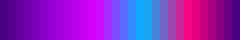
</td>
<td align="center" width="25%">
<strong>cosmos</strong><br/>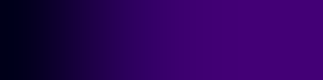
</td>
<td align="center" width="25%">
<strong>aurora</strong><br/>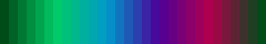
</td>
<td align="center" width="25%">
<strong>galaxy</strong><br/>
</td>
</tr>
</table>

### 💻 Tech Themes

Modern, cyberpunk-inspired themes that bring a digital aesthetic to your terminal.

<table>
<tr>
<td align="center" width="20%">
<strong>matrix</strong><br/>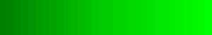
</td>
<td align="center" width="20%">
<strong>cyberpunk</strong><br/>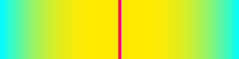
</td>
<td align="center" width="20%">
<strong>hackerman</strong><br/>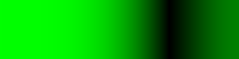
</td>
<td align="center" width="20%">
<strong>quantum</strong><br/>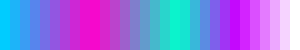
</td>
</tr>
</table>

### 🎭 Aesthetic Themes

Stylish gradients perfect for creative and artistic applications.

<table>
<tr>
<td align="center" width="25%">
<strong>pastel</strong><br/>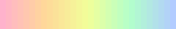
</td>
<td align="center" width="25%">
<strong>neon</strong><br/>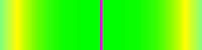
</td>
<td align="center" width="25%">
<strong>retrowave</strong><br/>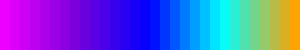
</td>
<td align="center" width="25%">
<strong>vaporwave</strong><br/>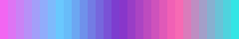
</td>
</tr>
</table>

### 🎉 Party Themes

Vibrant, energetic themes that bring celebration to your terminal.

<table>
<tr>
<td align="center" width="25%">
<strong>rave</strong><br/>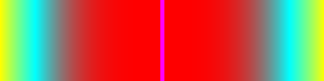
</td>
<td align="center" width="25%">
<strong>disco</strong><br/>
</td>
<td align="center" width="25%">
<strong>festival</strong><br/>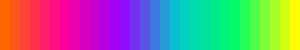
</td>
<td align="center" width="25%">
<strong>carnival</strong><br/>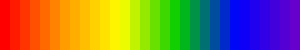
</td>
</tr>
</table>

### 🎓 Abstract Themes

Experimental and artistic gradients for unique visual effects.

<table>
<tr>
<td align="center" width="16.66%">
<strong>fire</strong><br/>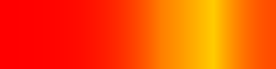
</td>
<td align="center" width="16.66%">
<strong>toxic</strong><br/>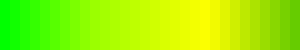
</td>
<td align="center" width="16.66%">
<strong>glitch</strong><br/>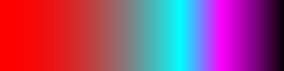
</td>
<td align="center" width="16.66%">
<strong>plasma</strong><br/>
</td>
</tr>
</table>

### 🌈 Pride Themes

Celebrate diversity with these pride flag-inspired gradients.

<table>
<tr>
<td align="center" width="14.28%">
<strong>lesbian</strong><br/>
</td>
<td align="center" width="14.28%">
<strong>trans</strong><br/>
</td>
<td align="center" width="14.28%">
<strong>nonbinary</strong><br/>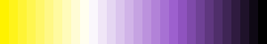
</td>
<td align="center" width="14.28%">
<strong>progress</strong><br/>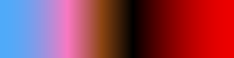
</td>
</tr>
</table>

## 💫 Usage Examples

### Basic Text Coloring

```bash
# Simple gradient
echo "Hello, World!" | chromacat

# Use the cyberpunk theme
echo "Hello, ChromaCat!" | chromacat -t cyberpunk

# Multiple files
chromacat file1.txt file2.txt
```

### Pattern Selection and Customization

```bash
# Diagonal gradient at 45 degrees
chromacat -p diagonal --param angle=45 file.txt

# Plasma effect with custom settings
chromacat -p plasma --param complexity=3.0,scale=1.5 file.txt

# Wave pattern with customization
chromacat -p wave --param amplitude=1.5,frequency=2.0 file.txt

# Ripple pattern from center
chromacat -p ripple --param wavelength=1.0,damping=0.5 file.txt
```

### Animation Effects

```bash
# Basic animation
cat your_file.txt | chromacat -a

# Smooth animation with custom FPS
ls -la | chromacat -a --fps 60 --smooth

# Infinite animation
chromacat --animate --duration 0 file.txt
```

### Advanced Usage

```bash
# Combine with other commands
git status | chromacat -p ripple -t neon

# Custom animation speed
find . -type f | chromacat -a --speed 0.5

# Progress logging with style
yarn build | chromacat -t cyberpunk
```

## 🎮 Interactive Controls

When running in animation mode (`-a`):

- `Space` - Pause/Resume animation
- `T` - Cycle through themes
- `P` - Cycle through patterns
- `Q` or `Esc` - Quit
- `←` `→` - Adjust animation speed
- `↑` `↓` - Scroll through content

## 🛠 Configuration Options

### Common Parameters

- `--frequency <0.1-10.0>` - Base pattern frequency
- `--amplitude <0.1-2.0>` - Pattern intensity
- `--speed <0.0-1.0>` - Animation speed

### Animation Settings

- `--fps <1-144>` - Frames per second
- `--duration <seconds>` - Animation duration (0 for infinite)
- `--smooth` - Enable smooth transitions
- `--no-color` - Disable colored output

### Pattern-Specific Parameters

```bash
# Plasma
chromacat -p plasma --param complexity=3.0,scale=1.5,blend_mode=add

# Ripple
chromacat -p ripple --param wavelength=1.0,damping=0.5,center_x=0.5,center_y=0.5

# Wave
chromacat -p wave --param amplitude=1.0,frequency=2.0,phase=0.0,offset=0.5

# Spiral
chromacat -p spiral --param density=2.0,rotation=90,expansion=1.5

# Checkerboard
chromacat -p checkerboard --param size=2,blur=0.1,rotation=45
```

## 🔧 Integration Tips

### Shell Aliases

```bash
# Add to your .bashrc or .zshrc
alias cat="chromacat"
alias ls="ls --color=always | chromacat -t ocean"
alias gl="git log --oneline --graph | chromacat -p wave -t neon"
```

### Build Logs

```bash
# Make your build logs fabulous
npm run build | chromacat -t cyberpunk
cargo build 2>&1 | chromacat -p plasma -t matrix
```

### System Monitoring

```bash
# Colorful system monitoring
watch -n1 "ps aux | sort -rn -k 3,3 | head -n 5 | chromacat -t heat"
```

## 📝 Custom Themes

ChromaCat supports custom theme files in YAML format:

```yaml
- name: custom-theme
  desc: A beautiful custom gradient
  colors:
    - [1.0, 0.0, 0.0, 0.0, red]
    - [0.0, 1.0, 0.0, 0.5, green]
    - [0.0, 0.0, 1.0, 1.0, blue]
  dist: even
  repeat: mirror
  speed: 1.0
  ease: smooth
```

Load custom themes with:

```bash
chromacat --theme-file my-themes.yaml -t custom-theme
```

## 🎯 Performance Considerations

ChromaCat is designed to be fast and efficient:

- Pre-computed lookup tables for pattern generation
- Efficient buffering for large inputs
- Smart terminal handling and state management
- Optional performance modes for resource-constrained environments

## 🤝 Contributing

Contributions are welcome! Here's how you can help:

1. Fork the repository
2. Create your feature branch (`git checkout -b feature/AmazingFeature`)
3. Commit your changes (`git commit -m 'Add some AmazingFeature'`)
4. Push to the branch (`git push origin feature/AmazingFeature`)
5. Open a Pull Request

## 📄 License

This project is licensed under the Apache License 2.0 - see the [LICENSE](LICENSE) file for details.

---

<div align="center">

Created by [Stefanie Jane 🌠](https://github.com/hyperb1iss)

If you find ChromaCat useful, [buy me a Monster Ultra Violet](https://ko-fi.com/hyperb1iss)! ⚡️

</div>
