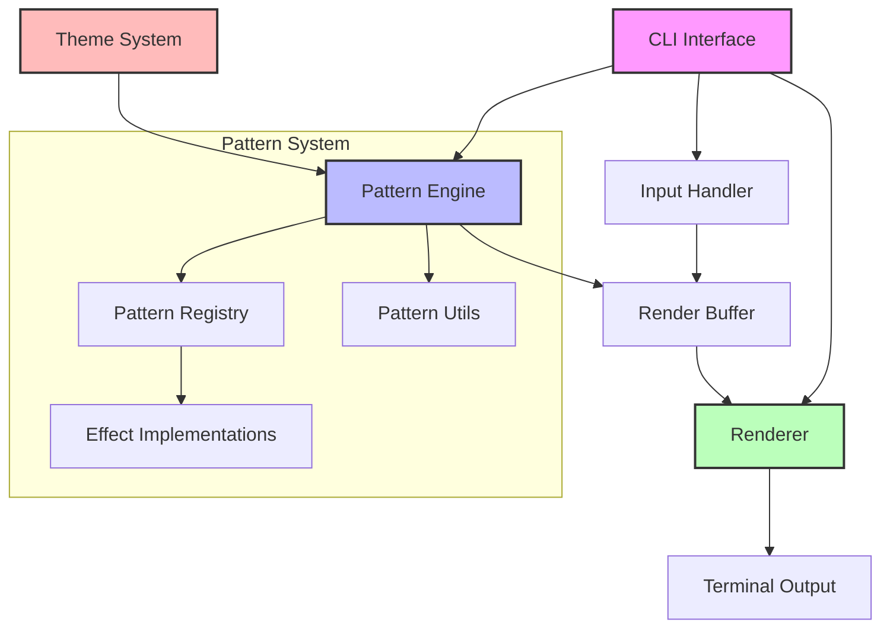
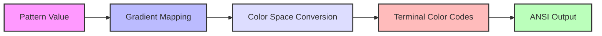
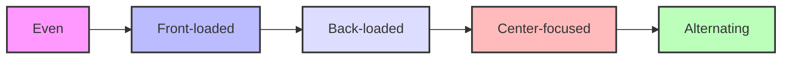

# ChromaCat: System Architecture & Technical Reference 🎨

> _Building a performant, extensible terminal colorizer_ ✨

## Table of Contents

1. [Introduction](#introduction)
2. [System Overview](#system-overview)
3. [Pattern System Architecture](#pattern-system-architecture)
4. [Rendering Pipeline](#rendering-pipeline)
5. [Theme System](#theme-system)
6. [Terminal Integration](#terminal-integration)
7. [Animation Framework](#animation-framework)
8. [Performance Optimization](#performance-optimization)
9. [Error Handling](#error-handling)
10. [Testing Strategy](#testing-strategy)
11. [Development Guide](#development-guide)

## Introduction

ChromaCat represents a sophisticated approach to terminal colorization, blending high performance with artistic expression. This document details the architectural decisions, implementation strategies, and technical considerations that power ChromaCat's capabilities.

### Design Philosophy

Our architecture embraces three core principles:

1. **Performance**: Every component is optimized for minimal overhead and maximum efficiency
2. **Extensibility**: The system is designed for easy addition of new patterns and features
3. **Reliability**: Robust error handling and graceful degradation ensure stable operation

## System Overview

At its heart, ChromaCat operates through a pipeline of specialized components:



### Core Components

The system is built around several key components, each with specific responsibilities:

```rust
pub struct ChromaCat {
    cli: Cli,
    engine: PatternEngine,
    renderer: Renderer,
    theme_system: ThemeSystem,
}
```

## Pattern System Architecture

The pattern system represents ChromaCat's artistic core, transforming mathematical expressions into stunning visual effects.

### Pattern Registry

The registry serves as the central orchestrator for all visual effects:

```rust
pub struct PatternRegistry {
    patterns: HashMap<String, PatternMetadata>,
}

pub struct PatternMetadata {
    id: &'static str,
    name: &'static str,
    description: &'static str,
    default_params: Arc<Box<dyn PatternParam + Send + Sync>>,
}
```

Pattern registration happens through a declarative macro system:

```rust
define_pattern_registry! {
    "horizontal" => {
        variant: Horizontal,
        params: HorizontalParams
    },
    "plasma" => {
        variant: Plasma,
        params: PlasmaParams
    },
    // Additional patterns...
}
```

### Pattern Implementation

Each pattern implements a trait that defines its behavior:

```rust
pub trait Pattern {
    fn generate(&self, x: f64, y: f64, time: f64, params: &PatternParams) -> f64;
    fn validate_params(&self, params: &str) -> Result<(), String>;
    fn default_params(&self) -> PatternParams;
}
```

For example, here's how the plasma pattern creates its psychedelic effect:

```rust
impl Pattern for PlasmaPattern {
    fn generate(&self, x: f64, y: f64, time: f64, params: &PlasmaParams) -> f64 {
        let time_sin = self.utils.fast_sin(time * PI);

        // Calculate primary wave components
        let wave1 = self.calculate_primary_wave(x, y, time_sin, params.frequency);
        let wave2 = self.calculate_secondary_wave(x, y, time_sin, params.scale);

        // Combine waves with complexity factor
        self.combine_waves(wave1, wave2, params.complexity)
    }
}
```

## Rendering Pipeline

The rendering system transforms pattern values into vibrant terminal output through several sophisticated stages.

### Double-Buffered Architecture

ChromaCat employs an advanced double-buffering strategy:

```rust
pub struct RenderBuffer {
    front: Vec<Vec<BufferCell>>,
    back: Vec<Vec<BufferCell>>,
    term_size: (u16, u16),
    line_info: Vec<(usize, usize)>,
}

#[derive(Debug, Clone, PartialEq)]
struct BufferCell {
    ch: char,
    color: Color,
    dirty: bool,
}
```

### Color Pipeline

The color transformation process follows a sophisticated pipeline:



### Frame Generation

The animation system produces smooth transitions through careful timing:

```rust
impl Renderer {
    pub fn render_frame(&mut self, text: &str, delta: f64) -> Result<()> {
        // Calculate precise frame timing
        let frame_time = self.calculate_frame_time(delta);

        // Update pattern state
        self.engine.update(frame_time);

        // Update visible buffer region
        self.update_visible_region()?;

        // Render to terminal
        self.draw_frame()?;

        Ok(())
    }
}
```

## Theme System

ChromaCat's theme system provides rich color manipulation capabilities:

```rust
pub struct ThemeDefinition {
    name: String,
    desc: String,
    colors: Vec<ColorStop>,
    dist: Distribution,
    repeat: Repeat,
    speed: f32,
    ease: Easing,
}
```

### Color Distribution

Themes support various distribution patterns:



### Gradient Generation

The gradient system creates smooth color transitions:

```rust
impl ThemeDefinition {
    pub fn create_gradient(&self) -> Result<Box<dyn Gradient + Send + Sync>> {
        let mut builder = GradientBuilder::new();

        // Configure color stops
        for color in &self.colors {
            builder.add_color(color.position, color.to_rgb());
        }

        // Apply distribution and easing
        builder.distribution(self.dist)
               .easing(self.ease)
               .build()
    }
}
```

## Terminal Integration

The terminal integration layer provides robust handling of terminal capabilities:

```rust
pub struct TerminalState {
    term_size: (u16, u16),
    colors_enabled: bool,
    alternate_screen: bool,
    raw_mode: bool,
    cursor_hidden: bool,
    is_tty: bool,
}
```

### Terminal Management

The system carefully manages terminal state:

```rust
impl TerminalState {
    pub fn setup(&mut self) -> Result<()> {
        // Enable raw mode if needed
        if !self.raw_mode {
            enable_raw_mode()?;
            self.raw_mode = true;
        }

        // Configure terminal state
        queue!(
            stdout(),
            EnterAlternateScreen,
            Hide,
            SetTitle("ChromaCat")
        )?;

        Ok(())
    }
}
```

## Animation Framework

The animation system provides smooth visual transitions:

```rust
pub struct AnimationConfig {
    fps: u32,
    cycle_duration: Duration,
    infinite: bool,
    smooth: bool,
    frame_metrics: FrameMetrics,
}
```

### Frame Timing

Precise frame timing ensures smooth animation:

```rust
impl Renderer {
    fn calculate_frame_time(&self, delta: f64) -> f64 {
        let target_duration = Duration::from_secs_f64(1.0 / self.config.fps as f64);
        let actual_duration = Duration::from_secs_f64(delta);

        if actual_duration < target_duration {
            thread::sleep(target_duration - actual_duration);
        }

        actual_duration.as_secs_f64()
    }
}
```

## Performance Optimization

ChromaCat employs several optimization strategies:

### Pattern Optimization

```rust
impl PatternUtils {
    #[inline(always)]
    pub fn fast_sin(&self, angle: f64) -> f64 {
        let normalized_angle = angle.rem_euclid(2.0 * PI);
        let index = ((normalized_angle * 180.0 / PI) as usize) % 360;
        self.sin_table[index]
    }
}
```

### Render Optimization

```rust
impl RenderBuffer {
    #[inline]
    fn update_region(&mut self, start: usize, end: usize) -> Result<()> {
        for y in start..end {
            if y >= self.back.len() { break; }
            for x in 0..self.term_size.0 as usize {
                let cell = &mut self.back[y][x];
                if cell.dirty {
                    self.update_cell(x, y)?;
                    cell.dirty = false;
                }
            }
        }
        Ok(())
    }
}
```

## Error Handling

ChromaCat implements a comprehensive error handling strategy:

```rust
pub enum ChromaCatError {
    IoError(io::Error),
    InvalidParameter { name: String, value: f64, min: f64, max: f64 },
    InvalidTheme(String),
    GradientError(String),
    PatternError { pattern: String, param: String, message: String },
    RenderError(String),
    TerminalError(String),
}
```

### Error Recovery

The system implements graceful degradation:

```rust
impl ChromaCat {
    fn handle_error(&mut self, error: ChromaCatError) -> Result<()> {
        match error {
            ChromaCatError::TerminalError(_) => self.terminal.try_recover()?,
            ChromaCatError::RenderError(_) => self.renderer.reset()?,
            _ => self.fallback_mode()?,
        }
        Ok(())
    }
}
```

## Testing Strategy

ChromaCat employs a comprehensive testing approach:

### Unit Testing

```rust
#[cfg(test)]
mod tests {
    #[test]
    fn test_pattern_generation() {
        let pattern = PlasmaPattern::new();
        let params = PlasmaParams::default();

        // Test pattern values
        let value = pattern.generate(0.5, 0.5, 0.0, &params);
        assert!((0.0..=1.0).contains(&value));
    }
}
```

### Integration Testing

```rust
#[test]
fn test_animation_pipeline() {
    let mut cat = ChromaCat::new(test_config());

    // Test full animation cycle
    for frame in 0..60 {
        assert!(cat.render_frame(frame as f64 / 60.0).is_ok());
    }
}
```

## Development Guide

### Getting Started

1. Clone the repository:

   ```bash
   git clone https://github.com/hyperb1iss/chromacat
   cd chromacat
   ```

2. Build the project:

   ```bash
   cargo build --release
   ```

3. Run tests:
   ```bash
   cargo test
   ```

### Contributing

When contributing to ChromaCat:

1. Follow the Rust style guide
2. Maintain test coverage
3. Document public APIs
4. Consider performance implications

## Conclusion

ChromaCat's architecture provides a robust foundation for terminal colorization while maintaining extensibility and performance. The modular design allows for easy addition of new patterns and features while ensuring maintainable code and reliable operation.

---

<div align="center">

For more information, visit our [GitHub repository](https://github.com/hyperb1iss/chromacat)

</div>
